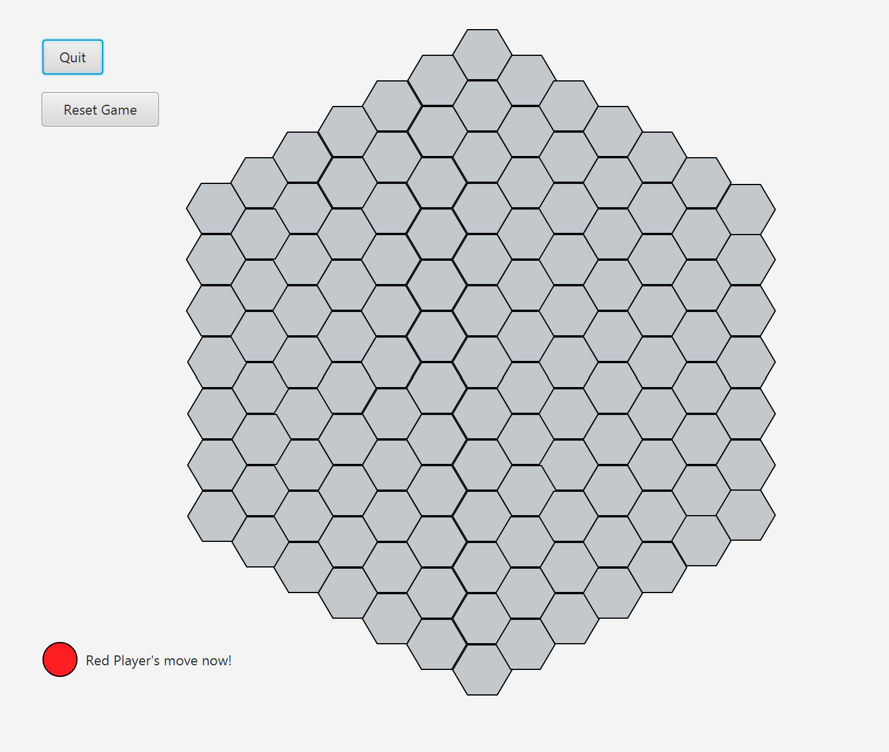
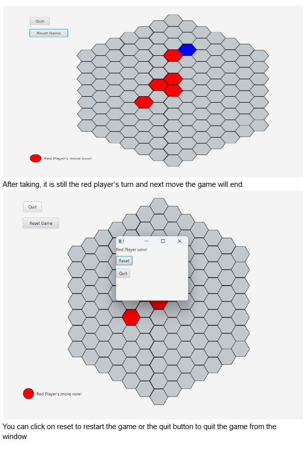

# HexOust

HexOust is a two-player strategy board game played on a **base 7 hexagonal board** with **127 hexagonal cells**. Players take turns placing their hexagon colours
with the objective of ousting their opponent by clearing all of oponents hexagons.

---

# Game Overview

- Two players: **RED** and **BLUE**
- Played on a **base-7 hexagonal board** (7 hexes per side, 127 total)
- Players take turns marking the hexagons as their own
- RED moves first
- No draws — every game ends in a win
- Two types of moves:
  - **NCP (Non-Capturing Placements)**
  - **CP (Capturing Placements)**

---

# Non-capturing Placement rules

A **Non-Capturing Placement** is a move that follows these rules:

- ✅ The hexagon you mark is **not adjacent** to any other hexagon (completely isolated), **OR**
- ✅ The hexagon you mark is adjacent **only to opponent's hexagon**
- ❌ The hexagon **must not** be adjacent to **any hexagon of the same color**.

**In short:**  
🔴 **A Non-Capturing Placement does _not_ form any connection with hexagons of your colour.**

# Capturing Placement Rules

A **Capturing Placement** is a move where you **connect your hexagons to your existing group** and potentially **capture opponent hexagons**.

To make a **valid Capturing Placement**, **all** of the following conditions **must be true**:

- ✅ The placed hexagon **connects to one or more of your own groups**.
- ✅ The new, merged group (after placement) **connects to one or more opponent groups**.
- ✅ **Each connected opponent group is smaller** than your new, merged group.
  
 

 In the above picture once the red player makes a CP, where they connect with the single red hexagon, the blue player gets eliminated

### Result of a Valid Capturing Placement

- All **connected opponent groups are removed** from the board.

---

### ⚠️ Important Notes

- You **cannot** capture if your new group is **equal to or smaller** than any connected opponent group.
- You **must** form a connection with both:
  - Your own group(s)
  - At least one opponent group

---

